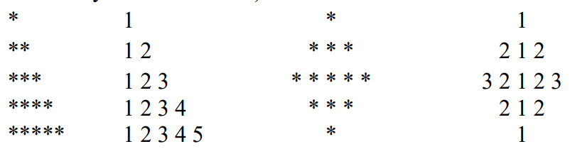
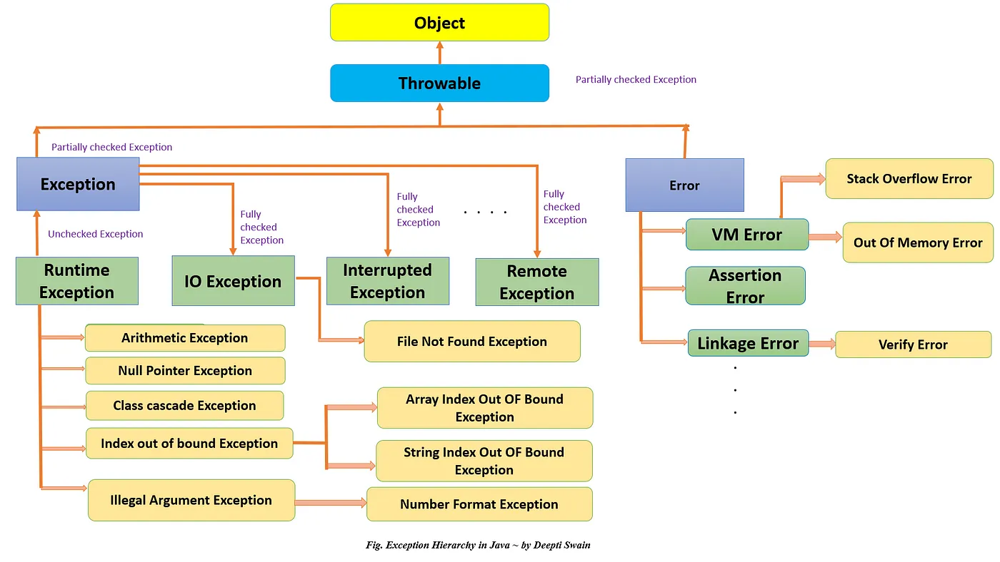
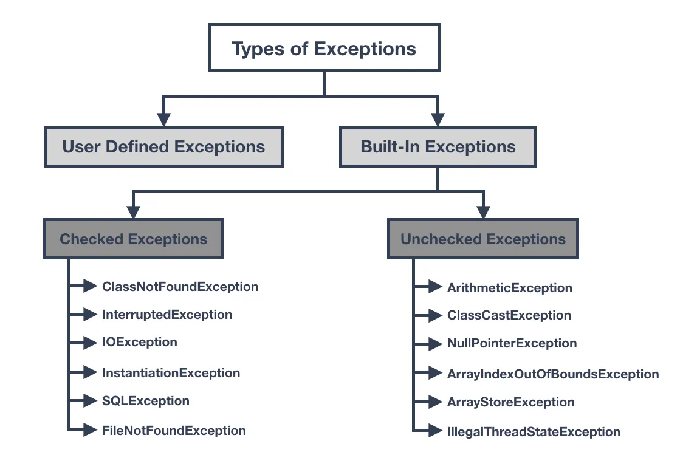

# Advanced Programming Practicals using Java
***
This repository contains the following listed Java Practicals that are done using Java.

- Input values using Scanner and display on the screen.
- Demonstrate loop and conditional statements: for-loop, while loop, if-else condition, if-elseif-else, switch, break and continue statements. 
- Demonstrate the use of primitive datatype available n Java and conversion between them using typecasting (if possible) to understand lossy/non-lossy conversions.
- Create the following patterns, (number of rows shall be entered by user at run time):
  
- Create Even Series, odd series, Fibonacci Series, Prime Series, Sin series, Cosine series. 
- Demonstrate various functions available in Maths class 
- Demonstrate the use of Biginteger and BigDecimal classes to perform operations on very large integer and decimals. 
- Demonstrate the creation and usage of static/non-static functions. 
- Demonstrate the use of Getters and Setters functions. 
- Demonstrate various kinds of comments available in java including documentation comments. 
- Demonstrate the use of enumerate data type 
- Demonstrate the use of various arithmetic, logical, bitwise, unary, ternary, assignment operators and understand their precedence and hierarchy(L to R, R to L). 
- Demonstrate the use 1D, 2D array and various functions available in Array class. 
- Demonstrate the concept of Array of objects, create Students class. Ask user at run time for the no. of students to be created. Create Students objects, initialize their values using setter functions. Display all the student’s details using getters functions. 
- WAP to create 100 random numbers( range 1 to 100) and store then in array, sort the array and display the sorted array using enhanced for loop

> #### :page_facing_up: [This is the practical file](Practical%20File/Advanced%20Programming%20Lab%20Programs%20By%20Tavneet%20singh.docx) which contains all the above listed programs in one file, you can use this file and make your own practical file by making some minor edits in the file. Due to the large size of the file it will not get loaded in the gitHub's browser file viewer, so download the file first and then open it.

### Following are some important concepts of Java:
- [Java Collection Hierarchy](#java-collection-hierarchy)
- [Java Exception Handling Class Hierarchy](#java-exception-handling-class-hierarchy)
- [Types of Exceptions in Java](#types-of-exceptions-in-java)

## Java Collection Hierarchy

The Java Collections Framework provides a well-designed set of interfaces and classes that support operations on collections of objects. The hierarchy of the Java Collection classes is as follows:

- The `Collection` interface (extended by `List`, `Set`, and `Queue`) is at the top of the collection hierarchy. This interface provides the basic methods that all collections will have, such as `add()`, `remove()`, and `contains()`.

- The `List` interface (implemented by classes like `ArrayList`, `LinkedList`, etc.) represents an ordered collection of elements which can contain duplicate values.

- The `Set` interface (implemented by classes like `HashSet`, `LinkedHashSet`, `TreeSet`, etc.) represents a collection of elements where each element is unique.

- The `Queue` interface (implemented by classes like `PriorityQueue`, `LinkedList`, etc.) typically represents a collection designed for holding elements prior to processing.

- The `Map` interface (implemented by classes like `HashMap`, `LinkedHashMap`, `TreeMap`, etc.) is not a true member of the Collection framework but it's fully integrated with collections. It represents a mapping from keys to values, where each key is unique.

Here is a diagram showcasing the hierarchy of the Java Collection classes:

|                                                                                                                                             |
|:--------------------------------------------------------------------------------------------------------------------------------------------------------------------------------------------------------------------:|
| Image Source: [Medium Article on Mastering the Java Collections Framework Hierarchy](https://medium.com/@mbanaee61/mastering-the-java-collections-framework-hierarchy-with-java-code-and-junit-testing-ab2eb87746ed) |

## Java Exception Handling Class Hierarchy

Java provides a robust and object-oriented approach to handle error scenarios, known as Java Exception Handling. The class hierarchy of the Java Exception classes is as follows:

- The `Throwable` class is the root class of Java Exception hierarchy which is inherited by two subclasses: `Exception` and `Error`.

- `Exception` class represents exceptions which are caused by the application itself. This class is further divided into `Checked Exceptions` (like `IOException`, `ClassNotFoundException`, etc.) and `Unchecked Exceptions` (like `ArithmeticException`, `NullPointerException`, etc.).

- `Error` class represents exceptions which are caused by errors in runtime environment (JVM). Examples: `OutOfMemoryError`, `StackOverflowError`, etc.

Remember, it's always a good practice to handle exceptions in order to maintain the normal flow of the application.

The following diagram shows the class hierarchy of the Java Exception classes:

|              |
|:-------------------------------------------------------------------------------------------------------------------------:|
| Image Source: [Interview Noodle Article on Exception in Java](https://interviewnoodle.com/exception-in-java-89a0b41e0c45) |

## Types of Exceptions in Java

In Java, exceptions are divided into two main categories: checked and unchecked exceptions.

- **Checked Exceptions**: These are the exceptions that are checked at compile time. If some code within a method throws a checked exception, then the method must either handle the exception or it must specify the exception using the `throws` keyword. Examples: `IOException`, `ClassNotFoundException`.

- **Unchecked Exceptions**: These are the exceptions that are not checked at compiled time. In C++, all exceptions are unchecked, so it is not forced by the compiler to either handle or specify the exception. It is up to the programmers to be civilized, and specify or catch the exceptions. Examples: `ArithmeticException`, `NullPointerException`, `ArrayIndexOutOfBoundsException`.

Here is a diagram showcasing the types of exceptions in Java:

|                                                      |
|:--------------------------------------------------------------------------------------------------------------------------------:|
| Image Source: [Medium Article on Java Exception Handling](https://medium.com/@bhavyasri9177/java-exception-handling-3b751904f41) |

## Developed With

The practicals in this project were developed using IBM Semeru Java JDK version 17.0.2 LTS. You can download the JDK for your specific operating system from the links below:

- [IBM Semeru JDK 17.0.2 for macOS x64](https://github.com/ibmruntimes/semeru17-binaries/releases/download/jdk-17.0.2%2B8_openj9-0.30.0/ibm-semeru-open-jdk_x64_mac_17.0.2_8_openj9-0.30.0.tar.gz)
- [IBM Semeru JDK 17.0.2 for Linux x64](https://github.com/ibmruntimes/semeru17-binaries/releases/download/jdk-17.0.2%2B8_openj9-0.30.0/ibm-semeru-open-jdk_x64_linux_17.0.2_8_openj9-0.30.0.tar.gz)
- [IBM Semeru JDK 17.0.2 for Windows x64](https://github.com/ibmruntimes/semeru17-binaries/releases/download/jdk-17.0.2%2B8_openj9-0.30.0/ibm-semeru-open-jdk_x64_windows_17.0.2_8_openj9-0.30.0.zip)

## Contributing
>  :handshake: Feel free to open an issue in this repository If you encounter any issues with the code or generate a pull request to this repository to contribute more programs regarding Advanced Programming done using Java. Whole Community will appreciate your feedback and contributions.

## Copyright
Copyright © 2024 [Tavneet Singh](https://github.com/Tavneetsingh01).

## License
This project is licensed under the MIT License - see the [LICENSE](LICENSE) file for details
 